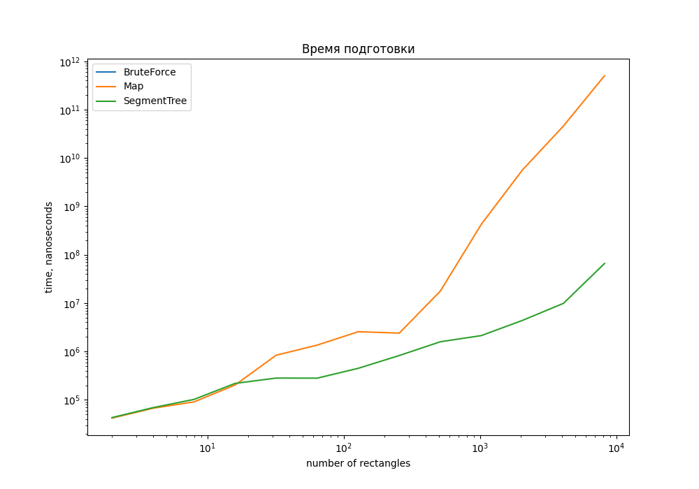
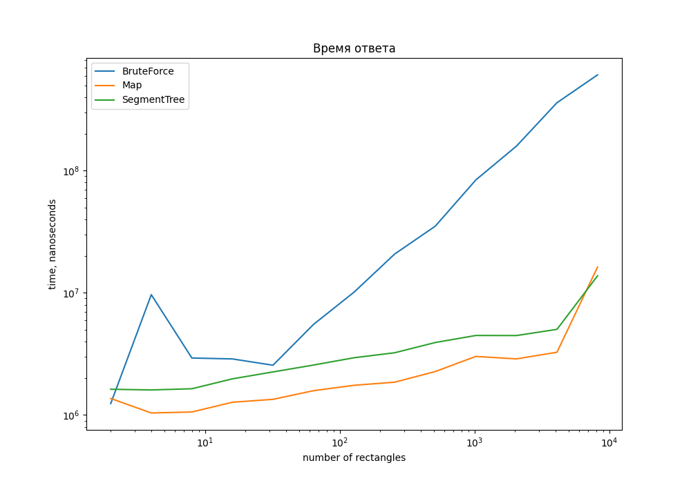
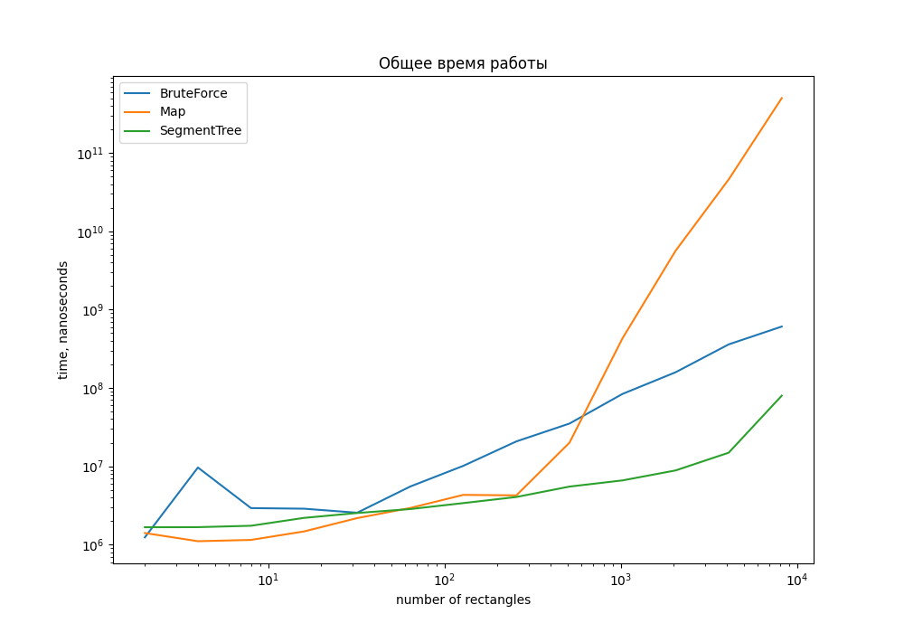

# АиСД
# Лабораторная работа №2
## Задача
Дано `N` прямоугольников на плоскости с углами в целочисленных координатах
 и `M` точек. Требуется как можно быстрее выдавать ответ на вопрос «Скольким прямоугольникам принадлежит точка
x
,
y
?». Если точка находится на границе прямоугольника, то считается, что она принадлежит ему. Подготовка данных должна занимать как можно меньше времени.

### Цель

Реализовать три разных решений задачи. Выяснить: при каком объеме начальных данных и точек эффекетивен каждый из алгоритмов.

## Реализация алгоритмов
## Полный перебор
Поиск `O(N * M)`, где `M` - количество точек, `N` - количество прямоугольников

Данный алгоритм подразумевает поочерёдный перебор каждого из прямоугольников для проверки: принадлежит ли точка текущему прямоугольнику. Дополнительная обработка данных не производится.

```java
static boolean contain(Rectangle rectangle, Point p){
        return rectangle.firstCoordinate.x <= p.x && rectangle.firstCoordinate.y <= p.y &&
        rectangle.secondCoordinate.x >= p.x && rectangle.secondCoordinate.y >= p.y;
}
        
static int[] bruteForceAlgo(Rectangle[] rectangles, Point[] points){
        int[] answer = new int[points.length];

        for(Rectangle rect:rectangles){
            for(int i = 0; i < points.length; ++i){
                if(contain(rect, points[i])){
                    ++answer[i];
                }
            }
        }
        return answer;
}
```

### Алгоритм на карте с сжатыми координатами
Подготовка `O(N^3)`, поиск `O(M * logN)`, где `M` - количество точек, `N` - количество прямоугольников

Для каждой точки необходимо определить положение на карте. Для этого требуется найти индексы координат точки. Ответ для каждой конкретной точки находится в ячейке под полученными индексами.
```java
    static int[] mapAlgo(Point[] points, int[][] map, int[] compressX, int[] compressY){
        int[] answer = new int[points.length];

        for(int i = 0; i < points.length; ++i){
            int posX = findPos(compressX, points[i].x);
            int posY = findPos(compressY, points[i].y);

            if(posX == -1 || posY == -1){
                answer[i] = 0;
            }else{
                answer[i] = map[posY][posX];
            }

        }

        return answer;
}
```

Для этого алгоритма необходимо предварительно выполнить следующие действия:
- сжать координаты данных прямоугольников. Для этого нужно записать все координаты прямоугольников по `x` в массив `compressX`, координаты по `y` в массив `compressY`. Далее следует отсортировать массивы по возрастанию `x` и удалить дубликаты. Индексы полученных массивов будут являться сжатыми координатами.
```java
    static Object[] compressCoordinates(Rectangle[] rectangles) {
        SortedSet<Integer> setCompressX = new TreeSet<>();
        SortedSet<Integer> setCompressY = new TreeSet<>();

        for (Rectangle rect : rectangles) {
            setCompressX.add(rect.firstCoordinate.y);
            setCompressY.add(rect.firstCoordinate.y);

            setCompressX.add(rect.secondCoordinate.x + 1);
            setCompressY.add(rect.secondCoordinate.y + 1);
        }

        int[] compressX = toInt(setCompressX);
        int[] compressY = toInt(setCompressY);

        return new Object[]{compressX, compressY};
}
```

- Построить матрицу карты по полученным сжатым координатам. Для каждого из прямоугольников необходимо найти индексы в матрице по сжатым координатам и в промежутке между найденными границами отметить наличие прямоугольника.
```java
    static int[][] createMap(Rectangle[] rectangles, int[] compressX, int[] compressY){
        int[][] matrixMap = new int[compressY.length][compressX.length];

        for(Rectangle rect:rectangles){
            int firstIndX = findPos(compressX, rect.firstCoordinate.x);
            int firstIndY = findPos(compressY, rect.firstCoordinate.y);
            int secondIndX = findPos(compressX, rect.secondCoordinate.x + 1);
            int secondIndY = findPos(compressY, rect.secondCoordinate.y + 1);

        for(int i = firstIndY; i < secondIndY; ++i){
            for(int j = firstIndX; j < secondIndX; ++j){
                ++matrixMap[i][j];
                }
            }
        }
        return matrixMap;
}
```

### Алгоритм на персистентонм дереве отрезков

Подготовка, `O(N * logN)`, Поиск`O(M * logN)`,  где `M` - количество точек, `N` - количество прямоугольников

Для ответа нужно найти нужный корень для данной точке в массиве `roots` посредством бинарного поиска нужного индекса в массиве `compressY` и осуществить спуск по дереву до нужного листа, просчитывая в процессе количество встретившихся прямоугольников.

```java
    static int getAnswer(Node node, int target) {
        if (node != null) {
        int mid = (node.leftInd + node.rightInd) / 2;

        if (target < mid) {
        return node.value + getAnswer(node.left, target);
        } else {
        return node.value + getAnswer(node.right, target);
        }
        }

        return 0;
        }
        
        
static int[] segTreeAlgo(Point[] points, int[] compressX, int[] compressY, Node[] roots) {
        int[] answer = new int[points.length];

        if (roots == null) {
            return answer;
        }

        for (int i = 0; i < points.length; ++i) {
            int posX = findPos(compressX, points[i].x);
            int posY = findPos(compressY, points[i].y);

            if (posX == -1 || posY == -1) {
                answer[i] = 0;
            } else {
                answer[i] = getAnswer(roots[posX], posY);
            }
        }

        return answer;
    }
```

Этот алгоритм подразумевает предварительную обработку входных данных:
- сжатие координат(функция, описанная выше)
- построение персистентного дерева отрезков. Для этого потребуется дополнительная структура - событие. Она подразумевает начало или конец существования прямоугольника. В структуру входят координата `x`, нижнюю границу по `y` - `beginY` и верхнюю - `endY`,а также `status`, обозначающий: `1` - начало ли прямоугольника или `-1` конец). Далее следует построить пустое дерево отрезков и добавить персистентные узлы.

### Тестирование и выводы

Данные для проведения тестов генерировались по следующим условиям:

- Для тестового набора прямоугольников - набор вложенных друг в друга прмоугольников. имеющих координаты с шагом больше 1:
`{(10*i, 10*i), (10*(2*N-i), 10*(2*N-i))}`.

- Для тестового набора точек - неслучайный набор координат точек распределенных равномерно по ненулевому пересечению прямоугольников - хэш функции от i с разным базисом для x и y:
`(p*i)^31%(20*N)`, p - большое простое, разное для x и y.

- Количество прямоугольников равно `2 ^ i`, где `0 <= i <= 13`

- Количество точек для каждого из значений `i` равнялось `10000`

Для двух алгоритмов требовалась подготовка данных, поэтому было рассмотрены две фазы:
- предобработка
- поиск ответа

### Измерение времени подготовки


На графике видно, что с ростом количества прямоугольников время обработки данных алгоритма на карте начинает резко расти. Такая ситуация возникла из-за большой асимптотики посторения карты - `O(N)`. В худшем случае нобходимо совершить `N` итераций по всей матрицы размером `N * N`. Построение персистентного дерева на небольших числах выполняется приблизительно за то же время, что и построение карты, однако с увеличением количества данных рост намного медленнее, поэтому алгоритм на дереве уже на сравнительно маленьком количестве треугольников позволяет производить предобработку в несколько раз быстрее, чем алгоритм на карте. Алгоритм полного перебора не затрачивает время на дополнительную подготовку данных.

### Измерение поиска ответа

Как можно заметить, в начале есть небольшой скачок, что объясняется языком написания алгоритмов, но это не влияет на общую картину измерений. На небольших входных данных алгоритмы работают за равное время, однако при увеличении количества прямоугольников до `32` и больше время работы алгоритма полного перебора быстро растет. В то время как два других сохраняют тенденцию. Рассмотрим подробнее алгоритмы с предобработкой: в основном алгоритм на карте лучше справляется с поиском ответа, чем алгоритм на дереве, несмотря на одинаковую асимптотику. Это происходит, потому что алгоритм на дереве сначала использует дважды бинарный поиск для нахождения индексов `x` и `y` координат точки в массивах сжатых координат, а затем осуществляет спуск по дереву - константа перед логарифмом больше, чем у алгоритма на карте. 

### Измерение общего времени работы


На основе данного графика можно сказать, что алгоритм на карте заметно уступает по времени двум другим, несмотря на быструю скорость поиска ответа, он проигрывает полному перебору уже на `32` прямоугольниках. Что касается алгоритма на дереве, то в основном быстрее всех справляется с данной задачей.

Подводя итоги, можно сказать, что полный пербор можно использовать на небольших данных для поиска ответа без затрат на дополнительную подготовку и память. Алгоритм на карте будет уместен при маленьком количестве прямоугольников и любом количестве запрашиваемых точек. Он не так сильно затратен в вопросе реализации, нежели чем алгоритм на персистентном дереве отрезков. Однако именно последний алгоритм будет хорошо справляться с поиском ответа на любых данных.

---
Алгоритмы находятся в пакете `algorithm`, тестирование - в пакете `test` файле `main`, генерация данных в файле `generateData`, полученные результаты - `results`